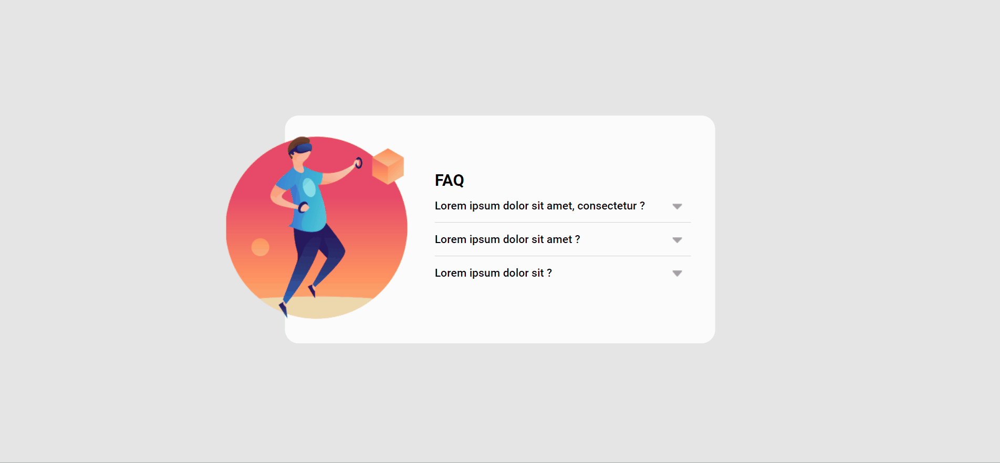
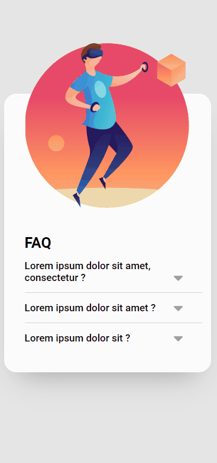

#  ACORDEON

Essa aplicação é um Acordeon, utilizando um layout do [Figma](https://www.figma.com/file/zBKnYG9UNdUiIr8ClQTWSG/?node-id=3%3A3).   

## Visão Geral 

 

- Clique na pergunta:  
 Conteúdo é mostrado.    
- Próximo clique em outra pergunta:   
    Conteúdo é mostrado e o anterior deixa de ser mostrado.
      
Ou seja, somente o conteúdo de uma pergunta fica visível.

 

###### _visualização desktop_

###### _visualização mobile_

 

[GitHub Pages]()

## Tecnologias Utilizadas
 

